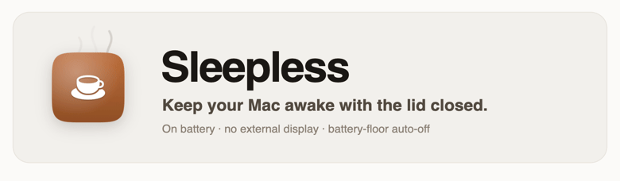
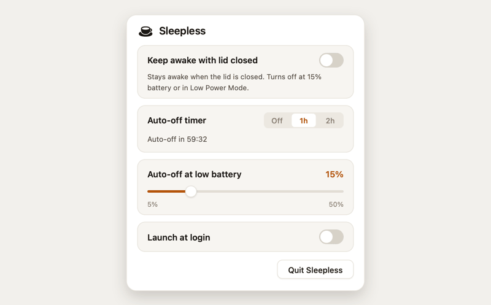

<p align="center">
  <a href="README.md">English</a> &nbsp;·&nbsp;
  <b>简体中文</b> &nbsp;·&nbsp;
  <a href="README.es.md">Español</a> &nbsp;·&nbsp;
  <a href="README.ja.md">日本語</a> &nbsp;·&nbsp;
  <a href="README.fr.md">Français</a> &nbsp;·&nbsp;
  <a href="README.de.md">Deutsch</a>
</p>

> 本译文由社区或机器翻译生成，可能落后于英文版 README。英文版为权威版本，请以 [English README](README.md) 为准。

<p align="center">
  <picture>
    <source media="(prefers-color-scheme: dark)" srcset="assets/hero-dark.gif">
    <source media="(prefers-color-scheme: light)" srcset="assets/hero-light.gif">
    
  </picture>
</p>

<p align="center">
  <b>合上盖子、使用电池、无外接显示器，让你的 MacBook 保持唤醒。</b><br>
  一个原生的菜单栏开关。内置电量下限自动关闭，让你永远不会把电池熬坏。
</p>

<p align="center">
  <a href="https://github.com/Aboudjem/Sleepless/actions/workflows/ci.yml"></a>
  <a href="https://github.com/Aboudjem/Sleepless/releases/latest"></a>
  <a href="https://github.com/Aboudjem/Sleepless/releases"></a>
  <a href="LICENSE"></a>
  
  <a href="https://github.com/Aboudjem/Sleepless/stargazers"></a>
</p>

<p align="center">
  
</p>

---

## 它能做什么

合上 MacBook 的盖子，它就会进入睡眠。通常这正是你想要的，但当一个通宵构建、一次长时间下载、一段 agent 运行，或者一个个人热点需要在笔记本躺在包里时继续工作时，情况就不同了。

**Sleepless** 是一个小巧的菜单栏应用，它会翻转那个真正能让 Mac 在合盖时保持唤醒的系统设置 `pmset disablesleep`，然后用一个自动的 **电量下限自动关闭** 来守护它，这样一个被遗忘的「开启」状态就不会耗尽电池或困住热量。

- 🌙 **一个原生开关。** 点击菜单栏里的月亮，翻转开关。图标一眼就能看出状态：空心的 `moon`（关闭）、实心的 `moon.fill`（开启）、`moon.stars.fill`（已就绪：使用电池保持唤醒，自动关闭已生效）。
- 🔋 **电量下限自动关闭。** 拖动滑块（5–50%，默认 15%）。在保持唤醒且正在放电时，一旦触及该下限，Sleepless 会自动关闭自己。
- 🖥️ **无需外接显示器、电源适配器或假负载转接头。** 只要合上盖子、使用电池即可。
- 🪶 **原生且小巧。** AppKit + SF Symbols，没有 Dock 图标，没有第三方依赖，没有后台守护进程，也没有 kext。整个应用就是一个 `App.swift`。
- 🔍 **对状态诚实。** 它会在每次切换后读回系统的实时值，因此开关反映的是现实，而不是一厢情愿的假设。

## 安装

### Homebrew（推荐）

```sh
brew install --cask aboudjem/tap/sleepless
```

这会 tap `Aboudjem/homebrew-tap` 并安装 `Sleepless.app`。然后运行一次性授权脚本（已打包在应用内），让它无需密码提示即可切换睡眠。在询问前，它会精确打印出自己将要写入的内容：

```sh
/Applications/Sleepless.app/Contents/Resources/grant.sh
```

### 下载发行版

从 [**Releases**](https://github.com/Aboudjem/Sleepless/releases/latest) 获取 `Sleepless-1.0.0.zip`，解压，并把 `Sleepless.app` 移动到 `/Applications`。由于它采用即兴签名（ad-hoc，未经过公证），macOS Gatekeeper 会阻止首次启动：打开 **系统设置 → 隐私与安全性 → 仍要打开**。（在 macOS 15+ 上，旧的「右键 → 打开」技巧已不再奏效。）

### 从源码构建（无 Gatekeeper 提示）

信任模型是「阅读源码，自己构建」。本地构建的应用不会被隔离，因此可以直接运行。

```sh
git clone https://github.com/Aboudjem/Sleepless.git
cd Sleepless
./install.sh        # builds, installs to /Applications, adds the grant + login item
```

单独运行 `./build.sh` 只会生成 `build/Sleepless.app`（仅需 Command Line Tools，无需 Xcode）。`./uninstall.sh` 会移除一切，并证明授权已不复存在。

## 为什么会有 Sleepless

Apple 的 `caffeinate`（以及每一个基于它构建的菜单栏应用，比如 KeepingYouAwake）**无法**在合盖时让 Mac 保持唤醒。它所使用的 IOKit 电源断言并不能覆盖硬件的合盖睡眠触发器，因此无论如何，合上盖子都会让 Mac 进入睡眠。唯一能覆盖合盖睡眠的系统开关是 `pmset disablesleep`。

确实有少数工具会用到 `disablesleep`，但每一个都留有缺口：Amphetamine 能做到（而且功能远不止于此），但它的合盖路径在 Apple Silicon 上出了名的难伺候；Macchiato 用的正是这个机制，却**完全没有**电池保护；Clapet 只有在连接**外接显示器**时才会触发。Sleepless 是为最普通的场景量身打造的开源工具：**合盖、使用电池、无显示器，并带有自动关闭，所以即便忘了它也很安全。**

## 对比

| | **Sleepless** | Amphetamine | KeepingYouAwake | Macchiato | Clapet | `caffeinate` |
|---|:---:|:---:|:---:|:---:|:---:|:---:|
| 合盖、使用电池保持唤醒 | ✅ | ✅¹ | ❌（拒绝） | ✅ | ⚠️ 需外接显示器 | ❌ |
| 无需外接显示器 | ✅ | ✅ | n/a | ✅ | ❌ | n/a |
| 电量下限自动关闭 | ✅ | 低电量时结束会话 | ✅（但不支持合盖） | ❌ | ❌ | ❌ |
| 机制 | `pmset disablesleep` + 受限范围的 sudoers | 公开 API ≈ `disablesleep` + IOKit | `caffeinate` | `pmset disablesleep` + 辅助程序 | `pmset` + sudoers | IOKit 断言 |
| 开源 | ✅ MIT | ❌（App Store） | ✅ MIT | ✅ Apache-2.0 | ✅ GPL-3.0 | Apple 内置 |
| Stars | 新项目 | App Store | ~6.6k | ~18 | ~101 | 不适用 |

<sub>¹ Amphetamine 支持这一功能，但在 Apple Silicon 上，它依赖一个单独安装的「Power Protect」脚本，并被广泛报告会在电源接入/断开以及 KVM/扩展坞配置下失效。Star 数量于 2026-06-01 拉取，会随时间变化。每一项竞品声明都在研究笔记中有出处；欢迎指正。</sub>

## 使用场景

每种场景都与电量下限搭配：设定一个你能接受的下限，然后转身离开。

- **离开后让长任务跑完。** 一次 agent/Claude 运行、一次渲染、一次编译、ML 训练，或一个大型 `brew`/`npm` 安装：打开 Sleepless，合上盖子，丢进包里，它会继续运行。
- **带着热点四处走动。** 来自 Mac 的个人热点 / 互联网共享在合盖时依然保持在线。
- **无人值守的传输。** 大型下载、上传，或一次需要在你离开期间完成的 Time Machine / 备份运行。
- **让服务器或 SSH 会话保持可达。** 本地开发服务器、一个 SSH 会话，或一个同步守护进程在合盖时依然存活。
- **让音频继续播放。** 音乐、一段长投屏，或一次音频渲染在包里继续播放。

## 安全模型

Sleepless 请求的是 root 权限的一个很窄的切片，下面就是它的全部内容。完整的威胁模型见 [SECURITY.md](SECURITY.md)。

GUI 应用没有可以输入密码的终端，因此 `install.sh` 会写入一个范围严格受限的 `/etc/sudoers.d` 配置文件（属主为 `root:wheel`，权限模式为 `0440`），并把你的用户名替换进去：

```
<you> ALL=(root) NOPASSWD: /usr/bin/pmset -a disablesleep 0, /usr/bin/pmset -a disablesleep 1
```

- **它只允许恰好两条命令，别无其他。** sudoers 会逐字匹配参数，而这条规则没有任何通配符，因此 `sudo pmset -a sleep 0`、`pmset restoredefaults` 或任何其他途径都会落空并要求输入密码。这个授权无法被扩大。
- **没有 shell，没有辅助脚本。** 应用以 argv 数组的形式调用 `sudo`（不经过 `/bin/sh -c`），且规则直接指向 Apple 的 `/usr/bin/pmset`。不存在任何用户可写、可供攻击者改写的脚本。
- **`disablesleep` 没有文档但确实存在。** 它不在 `man pmset` 中，但它会设置内核的 `SleepDisabled` 标志（`pmset -g | grep SleepDisabled`）。因为它没有文档，Apple 可能会改动它；Sleepless 会在每次切换后读回该值。
- **重启会把它重置为 `0`。** 它是一个运行时标志，所以没有办法让你的 Mac 永久无法睡眠。电量下限则是第二道安全网。
- **诚实的剩余风险：** 这个授权在设计上就是免密码的，因此任何以你身份运行的进程都可以翻转这个标志。最坏的情况是「你的 Mac 被保持唤醒，或被允许睡眠」，而不是数据丢失或 root 代码执行。
- **干净卸载。** `./uninstall.sh` 会移除应用、登录项和授权，然后通过显示 `sudo -n pmset …` 再次提示输入密码来证明权限已被撤销。

## 常见问题

**它真的能在合盖、使用电池、无显示器的情况下让 Mac 保持唤醒吗？**
是的，这正是它的全部意义所在。已在 macOS 26（Tahoe）/ Apple Silicon 上验证。

**月亮没有出现在我的菜单栏里。** macOS 26 可能会隐藏菜单栏项。检查系统设置（控制中心 / 菜单栏设置），确保允许 Sleepless 显示它的图标；如果 `pgrep -x Sleepless` 打印出一个数字，说明应用正在运行。

**为什么它没有经过公证？** 它是一个个人的开源工具，没有付费的 Apple Developer ID，所以采用即兴签名（ad-hoc）。从源码构建可以完全跳过 Gatekeeper，或者对预构建的应用使用 **仍要打开** 流程。何况公证本身也并不保证没有恶意软件。

**它会耗光我的电池吗？** 只有在你忽略下限时才会。在保持唤醒且正在放电时，Sleepless 会在你设定的电量百分比（默认 15%）自动关闭，而且重启总会恢复正常睡眠。

**它在 Intel Mac 或更旧的 macOS 上能用吗？** 它已在 **macOS 26 Apple Silicon** 上验证。`disablesleep` 没有文档，因此在其他版本/硬件上的行为无法保证。不妨试一试并告诉我们；欢迎诚实的反馈。

**我该如何彻底移除它？** `./uninstall.sh`（或删除 `/Applications/Sleepless.app`，用 `sudo rm` 移除 `/etc/sudoers.d/sleepless-disablesleep`，并对登录项执行 `launchctl bootout`）。

## 贡献

欢迎提交 Issue 和 PR，尤其是翻译，以及来自其他硬件/macOS 版本的诚实测试报告。请参阅 [CONTRIBUTING.md](CONTRIBUTING.md) 和 [行为准则](CODE_OF_CONDUCT.md)。Sleepless 会刻意保持小巧：那些会扩大权限面的功能不太可能被采纳。

## 许可证

[MIT](LICENSE) © 2026 Adam Boudjemaa。

---

<p align="center">
  <sub>如果 Sleepless 帮你省去了一趟开 Terminal 的麻烦，点个 ⭐ 能帮助更多人发现它。</sub>
</p>

